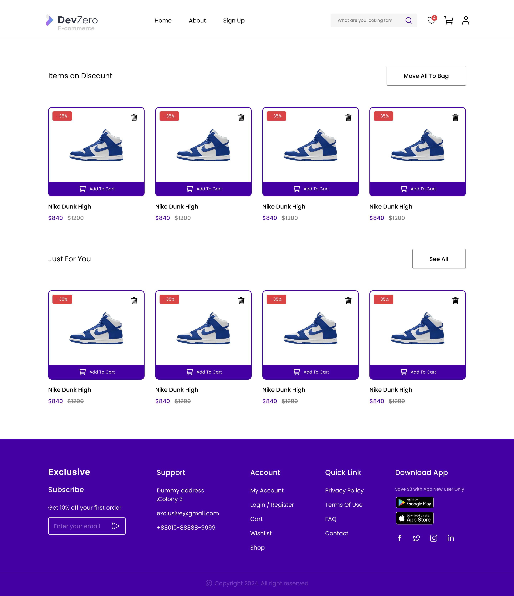
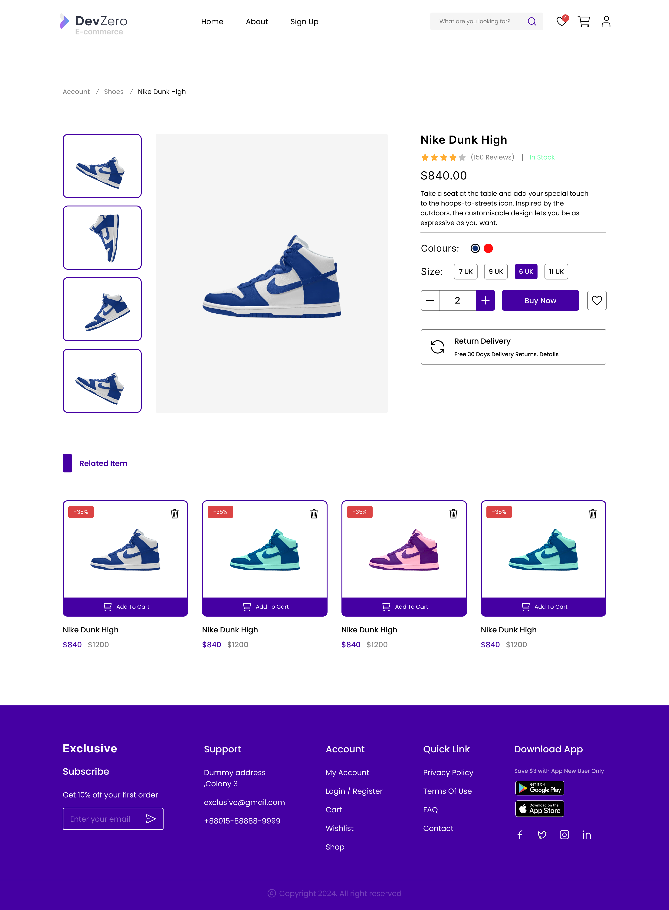
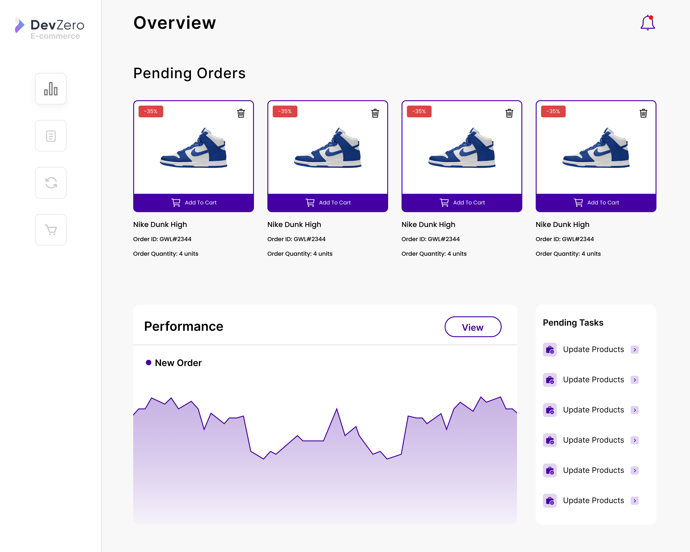

[](https://www.devzero.io/dashboard/recipes/new?repo-url=https://github.com/ScaleupInfra/dz-kafka)

# E-Commerce Application in DZ Workspace Cluster with Kafka as Message Broker

## Table of Contents
- [E-Commerce Application in DZ Workspace Cluster with Kafka as Message Broker](#e-commerce-application-in-dz-workspace-cluster-with-kafka-as-message-broker)
  - [Table of Contents](#table-of-contents)
  - [Project Overview](#project-overview)
  - [Objectives](#objectives)
  - [Tech Stack](#tech-stack)
    - [Backend](#backend)
    - [Frontend](#frontend)
    - [Infrastructure](#infrastructure)
  - [Architecture Diagram](#architecture-diagram)
  - [Project Structure](#project-structure)
  - [User Interface](#user-interface)
    - [Front-End](#front-end)
    - [Inventory Page](#inventory-page)
  - [Usage](#usage)
  - [Setup Kafka in Workspace](#how-to-setup-kafka-and-other-microservices-in-the-workspace)

## Project Overview
This project demonstrates a basic e-commerce single-page application (SPA) deployed in DevZero Workspace Cluster. The application uses Kafka as a message broker for handling asynchronous communication between different microservices, such as order processing and inventory management. The frontend is built with React, and the backend services are implemented using Node.js.

We're leveraging DevZero's built-in infrastructure template to simplify and accelerate the setup process. With DevZero, tools like kubectl, Helm, Terraform, and others are already configured, making it easier to set up Kafka and seamlessly integrate it with the rest of the services in our workspace. This eliminates the overhead of managing these tools manually and allows us to focus on building and deploying our application efficiently.

## Objectives
Scalable Infrastructure: Deploy the application in a DevZero Workspace Cluster to achieve scalability and high availability.
Event-Driven Architecture: Utilize Kafka as a message broker to decouple services and enable asynchronous processing.
Modern Web Application: Develop a responsive and dynamic single-page application using React and JavaScript.

## Tech Stack
### Backend
1. Node.js: Handles API requests, business logic, and communicates with Kafka.
2. Kafka: Used for message brokering between microservices (e.g., order service, inventory service).
### Frontend
1. React: Builds the user interface for the e-commerce application.
2. JavaScript: Core programming language for frontend logic and interactivity.
### Infrastructure
1. Docker: Used for containerizing the application components.
2. Kubernetes: Manages containerized applications across multiple hosts.
3. Kafka: Facilitates event-driven communication between microservices.

## Architecture Diagram


## Project Structure

```bash
e-commerce-app
├── backend/
│   ├── order-service/
│   └──inventory-service/
├── frontend/
│   └── react-app/
├── inventory-ui/
│   └── react-app/
├── k8s/
│   ├── order-service.yaml
│   ├── inventory-service.yaml
│   ├── kafka.yaml
│   ├── zookeeper.yaml
│   ├── inventory-ui.yaml
│   └── frontend.yaml
└── readme.md
```
1. backend/: Contains Node.js microservices for order and inventory management, along with Kafka producer and consumer.
2. frontend/: Contains the React SPA for the e-commerce platform.
3. inventory-ui/: Contains the React SPA for the inventory page.
4. k8s/: Kubernetes configuration files for deployments, services, and Kafka setup.

## User Interface
### Front-End



### Inventory Page


## Usage

Once deployed, you can access the e-commerce application through the provided IP address or domain. The React SPA will communicate with the backend services, which are decoupled using Kafka for message brokering.

## How to Setup Kafka and other microservices in the workspace

1. Create a new workspace in DevZero using the recipe **quickstart-infra**.
2. Connect to the workspace and create a new namespace `kubectl create namespace dz-kafka`.
3. Change the context to the new namespace `kubectl config set-context --current --namespace=dz-kafka`.
4. Clone this repository and go inside the folder `cd dz-kafka`.
5. Run k8s `kubectl apply -f k8s`.
6. Foward the port of the frontend deployment with the command `kubectl port-forward --address 0.0.0.0 deployment/frontend 8070:3000`.
7. Access the frontend on the browser: `http://<workspace-name>:8070`
8. Forward the port of the kafka-ui deployment with the command `kubectl port-forward --address 0.0.0.0 deployment/kafka-ui 8030:8080`.
9. Access the kafka-ui on `http://<workspace-name>:8030` and navigate to your topic in the UI to get the messages in it.
